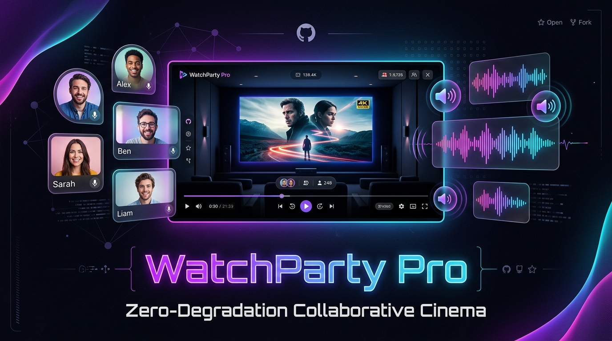

<div align="center">



# WatchParty Pro
**Zero-Degradation Collaborative Cinema & Spatial Voice Platform**

[](LICENSE)
[](server.py)
[](public/app.js)
[](extension/manifest.json)
[](https://neeraj15022001.github.io/watchparty-app/)
[](AI_DISCLOSURE.md)

[**Live Project Site & Changelog**](https://neeraj15022001.github.io/watchparty-app/) &bull; [**Architecture Specification**](ARCHITECTURE.md) &bull; [**Contributing**](CONTRIBUTING.md)

</div>

---

## Highlights

- **Zero Video Re-encoding:** Watch Netflix, YouTube, Prime Video, or direct URLs with friends in native 1080p / 4K / HDR with Widevine DRM untouched.
- **HTTP 206 Range Local Streaming:** Play multi-gigabyte local video files directly with instant timeline scrubbing and zero server transcoding overhead.
- **Sub-200ms NTP Precision Sync:** Uses Cristian's clock synchronization algorithm over WebSockets to steer playback rates smoothly without jarring jumps.
- **Smart Voice Ducking:** Built with the Web Audio API. Automatically lowers movie volume by 40% when friends speak over their microphones.
- **Decoupled WebRTC Mesh:** Low-latency voice and video chat that will never interrupt or stutter movie playback.
- **Zero Heavy Dependencies:** The backend signaling and media server is written in pure Python standard library (`asyncio`, `socket`). No `npm install`, no pip bloat.

---

## Comparison

| Feature | Teleparty | watchparty.me | WatchParty Pro |
| :--- | :--- | :--- | :--- |
| **Video Quality** | Pristine (Native OTT) | Degraded (Re-encoded WebRTC) | **Pristine (Native 4K / HDR)** |
| **Local Video Files** | Not Supported | Supported (Re-encoded) | **Supported (HTTP 206 Range)** |
| **Voice & Video Chat** | No (Text Only) | Yes | **Yes (Decoupled WebRTC Mesh)** |
| **Smart Voice Ducking** | No | No | **Yes (Web Audio API)** |
| **Server Bandwidth Cost** | Low | High | **Minimal (JSON + Direct Chunks)** |
| **DRM Compatibility** | Supported | Often Black Screen | **Fully Supported** |

---

## Quickstart

### 1. Clone & Run
```bash
git clone https://github.com/neeraj15022001/watchparty-app.git
cd watchparty-app
python3 server.py
```
*The server will start on `http://127.0.0.1:8080` with zero installation steps.*

### 2. Join a Room
Open your browser at:
```
http://localhost:8080/?room=cinema-night
```
Share the link with friends on your local network or via a tunnel (e.g. Cloudflare Tunnel or ngrok).

### 3. Load Companion Extension (for Netflix, YouTube, Prime)
1. In Chrome, Brave, or Edge, navigate to `chrome://extensions`.
2. Toggle on **Developer mode** in the upper right.
3. Click **Load unpacked** and select the [`extension/`](extension/) directory.
4. Open your favorite streaming platform and the in-page WatchParty HUD will automatically connect.

---

## Project Structure

```
watchparty-app/
├── server.py              # Pure Python 3 async WebSocket & HTTP Range server
├── assets/                # Visual assets and SVG banners
│   └── banner.svg         # Official project banner
├── docs/                  # Landing page & changelog (deployed to GitHub Pages)
│   ├── index.html         # Landing page website
│   ├── style.css          # Design system & responsive layout
│   └── app.js             # Interactive copy and smooth scrolling
├── public/                # Cinema web application
│   ├── index.html         # Theater UI, custom controls & ducking indicator
│   ├── style.css          # Dark cinema theme & active speaker pulse
│   └── app.js             # NTP clock sync, WebRTC mesh & Web Audio ducking
├── extension/             # Companion Browser Extension (Manifest V3)
│   ├── manifest.json      # Extension configuration
│   ├── content.js         # Player observer for Netflix, YouTube & Prime
│   ├── popup.html         # Room ID configuration dialog
│   └── popup.js           # Extension settings manager
└── .github/               # Workflows and templates
    ├── workflows/
    │   └── deploy-pages.yml # Automated GitHub Pages deployment
    ├── ISSUE_TEMPLATE/    # Bug report and feature request templates
    └── pull_request_template.md
```

---

## Open Source & Governance

- [**Contributing Guidelines**](CONTRIBUTING.md): Workflow, coding standards, and PR guidelines.
- [**Code of Conduct**](CODE_OF_CONDUCT.md): Contributor Covenant v2.1.
- [**Security Policy**](SECURITY.md): Vulnerability reporting and trust boundary model.
- [**Architecture Specification**](ARCHITECTURE.md): Mathematical formulas, drift correction thresholds, and data flow.
- [**AI Disclosure Statement**](AI_DISCLOSURE.md): Transparency on human-in-the-loop AI engineering and contribution etiquette.

---

## License

This project is licensed under the [MIT License](LICENSE) &copy; 2026 Neeraj Gupta.
